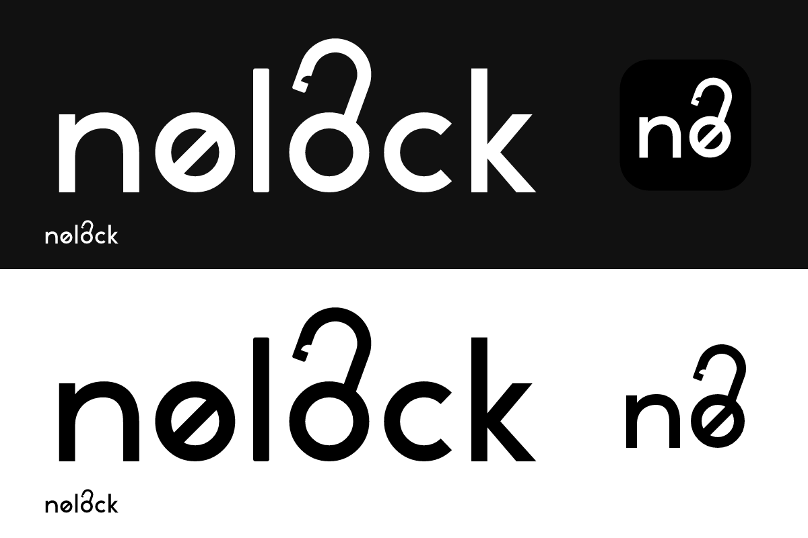

# nolock identity



The wordmark preserves the original lowercase `nølock`: a 45° slash through the first o and an open shackle rising from the second. The compact `nø` mark combines both details for smaller surfaces. Both versions share the same 20° shackle tilt and the curved latch notch inside the open tip.

The artwork is drawn from geometric paths, with 16-unit stems and circular bowls. It contains no fonts, embedded raster images, filters, or external resources. Black (#000000) and white (#FFFFFF) are the only brand colors.

## Assets

| Surface | Asset |
| --- | --- |
| Light backgrounds / README fallback | `src/assets/nolocklogo.svg` |
| Dark backgrounds / app menu / README dark theme | `src/assets/nolocklogo-white.svg` |
| Compact mark, black / white | `src/assets/nolock-mark.svg` / `nolock-mark-white.svg` |
| Desktop app / web favicon | `src/assets/nolock-icon.svg` |
| Desktop packages | `src-tauri/icons/` (PNG, ICO, ICNS) |
| Legacy white PNG | `src/assets/nolocklogo.png` |

The desktop icon uses the white compact mark on a black rounded tile. Use the transparent wordmark on contrasting backgrounds. Keep the SVG aspect ratio and its built-in clear space. Do not add a tagline within the logo; supporting copy belongs outside the artwork.

The app menu displays the wordmark at 34 px high. Login and access-check screens use the compact mark. The running desktop window loads the 256 px raster, while platform packages contain their own size variants.

## Regeneration

Edit the shared geometry in `scripts/generate-brand.py`, then run:

```sh
python3 scripts/generate-brand.py
python3 scripts/generate-brand.py --icons
```

The second command requires the project's installed Tauri CLI. The compatibility asset `nolocklogo-white-no.svg` is generated from the same compact geometry.
