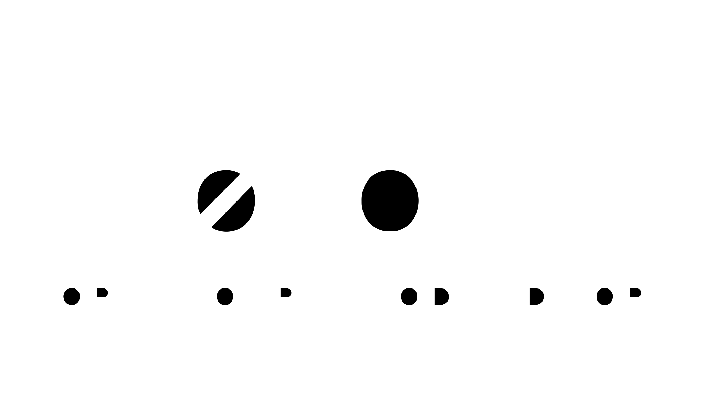

<p align="center">
  
</p>

<h1 align="center">nolock</h1>

<p align="center">
  <strong>A privacy-first, AI-native development environment for your local machine.</strong>
</p>

<p align="center">
  <em>Code. Chat. Terminal. Browser. All in one window — no cloud required.</em>
</p>

<p align="center">
  nolock's opinionated feature set is crafted to preserve cognitive load and maintain engineers' full ownership of their codebase. It leverages AI assistance without fostering over-reliance on LLM outputs — designed especially for Computer Science, Software Engineering, and technically-focused students who want to stay firmly in the driver's seat while avoiding excessive automation.
</p>

---

## About

**nolock** is a desktop IDE that puts you in full control. It combines a full-featured code editor (powered by Monaco), a real terminal emulator, an AI agent chat panel, a native web browser, and a workspace-wide file search — all running locally with no telemetry, no accounts, and no lock-in.

Connect it to your preferred AI backend (Ollama, llama.cpp, OpenRouter, or OpenCode Zen) for inline code completions and agentic chat with tool-calling capabilities (web search, file read, directory listing).

---

## Open Source Technologies

nolock is built on the shoulders of many incredible open-source projects. Below is a breakdown of what each one does and how it's used.

### Frontend

| Technology | What it is | How nolock uses it |
|---|---|---|
| **React 18** | A declarative, component-based UI library for building interactive user interfaces. | Drives the entire user interface — file explorer, editor tabs, chat panel, settings modals, and status bar. |
| **TypeScript** | A typed superset of JavaScript that compiles to plain JavaScript. | All frontend code is written in TypeScript for better developer experience, type safety, and maintainability. |
| **Vite** | A fast build tool and development server with hot module replacement. | Serves the frontend during development and produces optimized production bundles. |
| **Monaco Editor** | The same code editor that powers VS Code — a browser-based code editor with syntax highlighting, IntelliSense, and multi-language support. | Provides the main code editing experience with file-type detection, bracket colorization, minimap, and inline AI completions. |
| **xterm.js** | A fully-featured terminal emulator implemented in JavaScript that runs in the browser. | Renders the integrated terminal panel with full VT100/xterm escape sequence support, themes, and cursor handling. |
| **marked** | A low-level Markdown compiler built for speed. | Renders AI assistant responses with rich formatting — code blocks, headings, lists, inline code, and links. |
| **js-tiktoken** | A JavaScript port of OpenAI's tiktoken tokenizer, using the cl100k_base encoding. | Counts tokens in file contents and chat messages to provide context window awareness in the AI chat panel. |
| **Vitest** | A blazing-fast unit test framework powered by Vite. | Runs the frontend test suite (components, utilities, and integration tests). |
| **@testing-library/react** | Lightweight utilities for testing React components in a user-centric way. | Provides DOM-based testing utilities for React component tests. |

### Backend (Rust)

| Technology | What it is | How nolock uses it |
|---|---|---|
| **Tauri 2** | A framework for building desktop applications with a web frontend and a Rust backend. | The core application framework — manages windows, system tray, native menus, IPC between frontend and backend, and application lifecycle. |
| **serde / serde_json** | A serialization/deserialization framework for Rust. | Handles all JSON serialization for IPC commands, AI API requests/responses, and configuration persistence. |
| **reqwest** | An ergonomic, batteries-included HTTP client for Rust. | Makes HTTP requests to AI backends (Ollama, llama.cpp, OpenRouter, OpenCode Zen) for chat completions, code completions, and model information. |
| **portable-pty** | A cross-platform PTY (pseudo-terminal) library for Rust that works on Linux, macOS, and Windows. | Spawns and manages real interactive shell sessions (bash, zsh, etc.) with proper terminal dimensions, resizing, and signal handling. |
| **regex** | A Rust library for regular expression matching. | Powers workspace-wide file search with regex mode, case-insensitive matching, and batch find-and-replace across files. |
| **wry** | A cross-platform webview rendering library used by Tauri. | On Linux, creates a native GTK-based webview overlay for the in-app browser panel (supporting sites that block iframes). |
| **GTK3 (gtk-rs)** | Rust bindings for the GTK 3 toolkit. | On Linux, manages a GtkOverlay + GtkFixed widget setup to position the native browser webview precisely within the application layout. |

### AI Backends

| Technology | What it is | How nolock uses it |
|---|---|---|
| **Ollama** | A local server for running large language models on your own machine with a simple REST API. | Supports both inline code completions (via `/api/generate` with Fill-In-The-Middle) and multi-turn chat (via `/api/chat`) with tool calling. |
| **llama.cpp** | A C/C++ implementation of LLM inference optimized for consumer hardware. | Supports code completions via its `/completion` endpoint with Fill-In-The-Middle support. |
| **OpenRouter** | A unified API gateway that provides access to dozens of AI models from multiple providers. | Supports chat completions and tool calling through the OpenAI-compatible `/chat/completions` endpoint. |
| **OpenCode Zen** | An open-source AI coding backend. | Supports code completions and chat via its `/api/generate` endpoint. |

### Search & Data

| Technology | What it is | How nolock uses it |
|---|---|---|
| **DuckDuckGo Instant Answer API** | A free, no-API-key search API that returns topic summaries, definitions, and related topics as JSON. | Powers the `web_search` tool in Agent Chat — enables the AI to discover relevant URLs before fetching page content with `web_fetch`. No signup, no cost, privacy-respecting. |
| **Brave Search API** | A privacy-focused web search API that returns real web search results (titles, URLs, descriptions). | Optional alternative to DuckDuckGo for the `web_search` tool — provides full web search results with better coverage for technical queries. Requires a free API key from [Brave Search API](https://brave.com/search/api/). |

---

## Features

- **Code Editor** — Full-featured Monaco editor with syntax highlighting for 100+ languages, bracket colorization, minimap, word wrap, and **inline linting** (ESLint for TypeScript/JavaScript, Ruff for Python, Clippy for Rust) with configurable rules via <kbd>Ctrl+E, S</kbd>.
- **File Search & Replace** — Search across all workspace files with regex support, match-case toggles, debounced live results, grouped by file with inline match previews, and batch replace-all with confirmation.
- **AI Inline Completions** — Fill-In-The-Middle (FITM) code suggestions from your local AI backend, debounced and triggered on typing pauses.
- **Agent Chat** — Multi-turn conversational AI chat with file referencing (`@` mentions), tool calling (web search, web fetch, file read, directory listing), and context token tracking.
- **AI Agent Manager** — Create and manage specialized AI agents (e.g., code-reviewer, doc-writer) stored as `.json` files in the `.agents/` directory with custom system prompts.
- **Human Feedback (RLHF)** — Collect thumbs-up/thumbs-down (KTO) and pairwise preference (DPO) feedback on AI chat responses. All data is saved as JSONL lines partitioned by model configuration under a configurable `dpo/` parent directory, ready for downstream RLHF training. Enable/disable via <kbd>Ctrl+A, R</kbd>.
- **Integrated Terminal** — Real PTY-based shell sessions with multiple tabs, resize support, and command history tracking.
- **Terminal Memory** — Automatically records commands, tracks frequency, and lets you organize commands into categories for quick recall.
- **File Explorer** — Tree-based file browser with directory expansion, refresh, file-type color coding, and file/directory CRUD operations (create, rename, delete, copy).
- **Native Browser Panel** — Embedded web browser using a native OS webview (not an iframe) — browse any site without leaving the app.
- **Resizable Panels** — All panels (explorer, editor, terminal, browser, chat) are fully resizable with drag handles.
- **Multi-Backend AI** — Switch between Ollama, llama.cpp, OpenRouter, and OpenCode Zen for completions and chat.
- **Privacy-First** — No telemetry, no accounts, no cloud dependency. Everything runs on your machine.

---

## Human Feedback (RLHF) — KTO & DPO

### The Problem

Large language models are typically fine-tuned on general internet text, not on *your* coding preferences. Out of the box, an AI assistant might be too verbose, too terse, too eager to generate boilerplate, or simply wrong in domain-specific ways. The most effective way to align a model to *your* standards is to show it what *you* consider good and bad — but collecting that feedback is usually the bottleneck.

nolock's RLHF system solves this by instrumenting the AI chat panel with two lightweight feedback mechanisms that integrate directly into your natural coding workflow. The collected data is stored in a structured, portable format that can be used to fine-tune any compatible model.

### Key Concepts

#### Reinforcement Learning from Human Feedback (RLHF)

RLHF is a family of techniques that use human preference data to align language model outputs with human values, style, and correctness. The core idea is simple: instead of trying to write a perfect system prompt that covers every edge case, you let the model generate responses and then tell it which ones are better. Over enough examples, the model learns to prefer the patterns you reward.

nolock's RLHF system collects training data in two complementary formats:

#### KTO — Kahneman-Tversky Optimization

KTO (named after psychologists Daniel Kahneman and Amos Tversky) is a **binary preference** method. For each AI response, you give a simple thumbs-up or thumbs-down:

- **Thumbs-up** → saved as a "good" example (label: `true`)
- **Thumbs-down** → saved as a "bad" example with an optional correction describing what was wrong (label: `false`)

KTO is lightweight and requires no extra AI calls — it piggybacks on your normal chat usage. Every rating you give becomes a training example. The optional correction text serves as a natural-language signal for what a better response would look like.

#### DPO — Direct Preference Optimization

DPO (Direct Preference Optimization) is a **pairwise preference** method that captures more nuanced judgements. Instead of rating a single response, you compare two alternative responses and pick the better one:

- **What happens**: Every N user messages (configurable in RLHF settings), the AI generates *two* responses instead of one. The second response uses a slightly higher temperature (+0.2) to produce meaningful diversity.
- **You choose**: A side-by-side comparison UI lets you pick which response is better (Response A or Response B). The pair (chosen + rejected) is saved as a DPO training example.
- **Why it matters**: Pairwise comparisons are statistically more reliable than absolute ratings. DPO also avoids the complexity of training a separate reward model (as used in traditional RLHF with PPO), making it practical for individual developers and small teams.

### Storage Format

All feedback is stored as **JSONL** (one JSON object per line) under the project's `.rlhf/` directory, which mirrors the structure used by popular training frameworks:

```
<project>/.rlhf/
  dpo/
    good/
      <provider>_<model>/data.jsonl    ← KTO thumbs-up examples
    bad/
      <provider>_<model>/data.jsonl    ← KTO thumbs-down examples
    pairwise/
      <provider>_<model>/data.jsonl    ← DPO chosen/rejected pairs
```

Each model configuration gets its own subdirectory (e.g., `ollama_qwen3_8b`), making it easy to train on data from specific models. The JSONL schemas follow the standard formats expected by KTO and DPO training scripts:

**KTO entry:**
```json
{
  "prompt": "What is Rust?",
  "response": "Rust is a systems language.",
  "label": true,
  "model_provider": "ollama",
  "model_name": "qwen3:8b",
  "model_configurations": { "temperature": 0.7, "max_tokens": 2048, "system_prompt": "" },
  "timestamp": "2026-06-26T12:00:00.000Z"
}
```

**DPO entry:**
```json
{
  "prompt": "What is Rust?",
  "chosen": "Rust is a systems language focused on safety.",
  "rejected": "Rust is a programming language.",
  "model_provider": "ollama",
  "model_name": "qwen3:8b",
  "model_configurations": { "temperature": 0.7, "max_tokens": 2048, "system_prompt": "" },
  "timestamp": "2026-06-26T12:00:00.000Z"
}
```

### Why This Matters for nolock

1. **Privacy-first, always**: All feedback data stays on your machine — in your project's `.rlhf/` directory. There is no telemetry, no cloud upload, and no third-party access. You own your preference data completely.

2. **No extra workflow burden**: Thumbs-up/down buttons appear naturally on every AI response. DPO prompts happen at configurable intervals. Feedback collection is woven into the chat experience, not a separate chore.

3. **Portable and framework-ready**: The JSONL format is the standard input for popular RLHF training libraries (e.g., Hugging Face TRL, Axolotl, LLaMA Factory). Export your `.rlhf/` directory to any training pipeline — no conversion needed.

4. **Model-configuration aware**: Because data is partitioned by provider + model (e.g., `ollama_qwen3_8b` vs `openrouter_gpt-4o`), you can train separate adapters for different models or analyze which backends produce the most preferred responses.

5. **Aligned with nolock's philosophy**: nolock is designed to keep you in the driver's seat. RLHF isn't about automating away your judgement — it's about amplifying it. The AI learns from *your* preferences, not from generic alignment data collected by a corporation.

### Getting Started

Press **`Ctrl+A, R`** to open the RLHF settings panel. There you can:

- Toggle feedback collection on/off
- Configure the root directory and category subdirectories
- Enable DPO pairwise mode and set the prompt interval
- Review the expected file structure for your settings

Every AI chat response will then show thumbs-up and thumbs-down buttons. If DPO is enabled, the system will automatically generate two responses at the configured interval for you to compare.

---

## Acknowledgements

nolock would not exist without the following open-source projects and communities:

- **[OpenCode Zen](https://opencode.ai)** — For providing an open AI coding backend and inspiring the vision of local-first AI development tools. This project was built primarily using the **Big Pickle** model (`opencode/big-pickle`) — a generous, free-tier AI provider that made autonomous development workflows possible without any API costs.

  > **Cost Tracker:** This project has incurred **$0.00 USD** in AI API costs to date. All development was powered entirely by OpenCode Zen's free Big Pickle model.
- **[OpenRouter](https://openrouter.ai)** — For building a unified API that makes dozens of AI models accessible from a single endpoint.
- **[Ollama](https://ollama.com)** — For making local LLM deployment as simple as a single command, enabling private and offline AI-powered development.
- **[llama.cpp](https://github.com/ggerganov/llama.cpp)** — For the incredible engineering achievement of running state-of-the-art LLMs efficiently on consumer hardware.
- **[DuckDuckGo](https://duckduckgo.com)** — For providing a free, no-API-key Instant Answer API that powers the `web_search` tool in Agent Chat. Results from DuckDuckGo.
- **[Brave Search](https://brave.com/search)** — For providing a privacy-focused web search API with real web search results, enabling the optional `web_search` tool backend for more comprehensive coverage.

And to all the open-source projects listed above — Monaco Editor, React, Tauri, xterm.js, and every other library that makes this possible. Thank you.

---

## Installation

### Prerequisites

Before installing nolock, ensure you have the following:

- **Node.js 18+** — [Download](https://nodejs.org/)
- **Rust toolchain** — [Install Rust](https://rustup.rs/)
- **Tauri system dependencies** — See [Tauri prerequisites](https://v2.tauri.app/start/prerequisites/)

### Build from Source

```bash
# Clone the repository
git clone https://github.com/your-username/nolock.git
cd nolock

# Install JavaScript dependencies
npm install

# Build and bundle the application
npm run tauri build
```

### Size Comparison

| Application | Package Type | Size | vs. nolock |
|---|---|---|---|
| **nolock** | `.deb` | **8.3 MB** | — |
| **VS Code** | `.deb` | ~100 MB | ~12× larger |
| **OpenCode Desktop** | `.deb` | ~107 MB | ~13× larger |
| **OpenCode CLI** | `.tar.gz` | ~49 MB | ~6× larger |

nolock is **significantly smaller** than comparable development tools. The `.deb` package is only **8.3 MB** — roughly the size of a single high-resolution photo — while the uncompressed binary is **21 MB**. This tiny footprint is achieved through a lean technology stack (Tauri + Rust + webview) that avoids bundling an entire browser runtime, unlike Electron-based editors.

### Ubuntu (Debian-based Linux)

After building, install the `.deb` package:

```bash
# Install the deb package
sudo dpkg -i src-tauri/target/release/bundle/deb/nolock_0.1.0_amd64.deb

# If there are missing dependencies, fix them:
sudo apt-get install -f
```

Or run the binary directly without installing:

```bash
./src-tauri/target/release/nolock
```

The application will be available in your app launcher as **nolock** after installation.

**Note:** On Linux, the native browser panel uses a GTK overlay widget for precise positioning. This works on all major Linux desktop environments (GNOME, KDE, XFCE, etc.).

### macOS

After building on a Mac, you have two options:

**Option A — Drag-and-drop DMG:**
```bash
# Open the DMG installer
open src-tauri/target/release/bundle/dmg/nolock_0.1.0_x64.dmg
# Then drag nolock into the Applications folder
```

**Option B — Direct .app bundle:**
```bash
# Copy the app bundle to Applications
cp -R src-tauri/target/release/bundle/macos/nolock.app /Applications/
```

Then open nolock from your Applications folder or Spotlight.

> **Note:** macOS builds require a Mac with Xcode installed. If you're on Linux but want a macOS build, you can use GitHub Actions with a macOS runner (see the CI workflow).

### Setting Up AI Backends

After installation, configure your preferred AI backend:

1. Open nolock and press **`Ctrl+A, I`** (or go to AI Integrations → Settings).
2. Select your backend:
   - **Ollama** — Default, runs locally at `http://localhost:11434`
   - **llama.cpp** — Runs locally at `http://localhost:8080`
   - **OpenRouter** — Requires an API key from [openrouter.ai](https://openrouter.ai)
   - **OpenCode Zen** — Runs locally at `http://localhost:11435`
3. Enter your model names and save.

### Recommended Ollama Models

For the best experience with nolock, here are the recommended Ollama models for each AI feature:

| Feature | Recommended Model | Size | Notes |
|---|---|---|---|
| **Code Completions (FITM)** | `qwen2.5-coder:0.5b` | 0.5B params | Fast, lightweight fill-in-the-middle completions. Runs on CPU or low-end GPU. |
| **Agent Chat (Tool Calling)** | `qwen3:0.6b` | 0.6B params | Smallest model with reliable tool-calling capabilities. Good for basic web search, file read, and directory listing tasks. |

**Installation:**

```bash
ollama pull qwen2.5-coder:0.5b
ollama pull qwen3:0.6b
```

Then in nolock's AI Settings (`Ctrl+A, I`):
- Set **Completion Model** to `qwen2.5-coder:0.5b`
- Set **Chat Model** to `qwen3:0.6b`

> **Note:** For agent chat with tool calling, the model must support the `tools` parameter in Ollama's `/api/chat` endpoint. The `qwen3:0.6b` model is the smallest tested model that supports this. Larger models (e.g., `qwen3.5-4b`) will provide better results at the cost of higher resource usage.

### Keyboard Shortcuts

#### Editor Settings (Ctrl+E chord)

| Shortcut | Action |
|---|---|
| `Ctrl+E, E` | Toggle file explorer |
| `Ctrl+E, S` | Open editor settings (linter configuration) |

#### File & Search (Ctrl+F chord)

| Shortcut | Action |
|---|---|
| `Ctrl+F, S` | Toggle file search |
| `Ctrl+F, O` | Open folder |
| `Ctrl+F, E` | Toggle file explorer |
| `Ctrl+F, R` | Refresh explorer |

Within the search panel (`Ctrl+F, S`):

| Key | Action |
|---|---|
| `Escape` | Close search panel |
| `Enter` | Trigger search immediately (bypasses debounce) |
| Click result line | Open file at that line |

#### Terminal (Ctrl+T chord)

| Shortcut | Action |
|---|---|
| `Ctrl+T, T` | New terminal |
| `Ctrl+T, M` | Open terminal memory overlay |

#### AI (Ctrl+A chord)

| Shortcut | Action |
|---|---|
| `Ctrl+A, C` | Toggle agent chat panel |
| `Ctrl+A, P` | Model providers |
| `Ctrl+A, M` | Chat model settings |
| `Ctrl+A, F` | FITM model settings |
| `Ctrl+A, T` | Agent tools |
| `Ctrl+A, G` | Manage AI agents |
| `Ctrl+A, K` | Manage skills |
| `Ctrl+A, R` | Human feedback (RLHF) |
| `Ctrl+A, I` | Open AI settings |
| `Ctrl+Shift+I` | Direct AI settings |

#### Browser

| Shortcut | Action |
|---|---|
| `Ctrl+Shift+B` | Toggle browser panel |

#### Direct Shortcuts

| Shortcut | Action |
|---|---|
| `Ctrl+O` | Open folder |
| `Ctrl+R` | Refresh explorer |
| `Ctrl+S` | Save current file |
| `Escape` | Close overlays / panels |

---

<p align="center">
  <sub>Built with ❤️ for local-first, privacy-respecting development.</sub>
</p>
